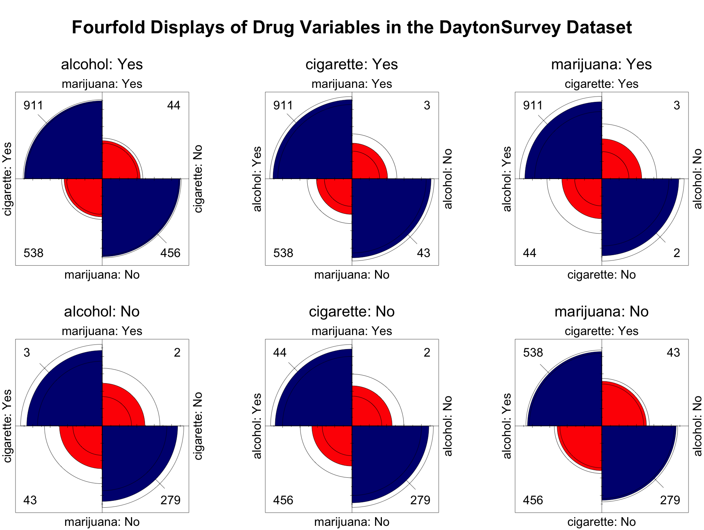

```{r setup, include=FALSE}
#--- Chunk options ---#
knitr::opts_chunk$set(
  warning = FALSE,   # avoid warnings and messages in the output
  message = FALSE,
  fig.height = 6,    # set default figure size
  fig.width = 6.5,
  include = FALSE,
  echo = FALSE
)
#------#

#--- Load packages ---#
library(ca)
library(dplyr)
library(effects)
library(emmeans)
library(ggplot2)
library(MASS)
library(magick)
library(vcd)
{
  options(rgl.useNULL = TRUE)
  Sys.setenv(RGL_USE_NULL = "TRUE")
  library(vcdExtra)
}
library(VGAM)
#------#

#--- Functions ---#
gavinTheme <- function(){
   # Theme for ggplot2 graphs. Used by adding to existing ggplot2 object.

   theme_minimal() +
   theme(
      plot.title = element_text(hjust = .5, margin = margin(r = 20,b = 10)),
      axis.ticks = element_line(colour = "black", size =.5),
      axis.line = element_line(colour = "black", size = .5),
      axis.text = element_text(size = 10),
      axis.title.x = element_text(margin = margin(t = 10)),
      axis.title.y = element_text(margin = margin(r = 10)),
      panel.grid.major = element_blank(),
      panel.grid.minor = element_blank(),
      plot.margin = margin(t = 10, r = 20, b = 10, l = 10)
   )
}

no_lead_zero <- function(x){
  #' A function to remove leading zeros from numbers of numeric type to aid 
  #' statistical reporting. Returns a string with the leading zero(s) removed.
  
  if (x < 0)
    res <- sub("^-0+", "-", x)
  else
    res <- sub("^0+", "", x)

  return(res)
}
#------#

#--- Load data ---#
data("DaytonSurvey", package = "vcdExtra")
data("housing", package = "MASS")
#------#
```


<!-- start of title page, TOC. Title page adapted from template online 
https://www.overleaf.com/latex/templates/operating-systems-laboratory/wswyyqztyryp

Claude assisted with parsing this template into something I could easily paste 
into this document: https://claude.ai/share/d8fa7701-5775-4ffb-84e2-97c80d2cda9b
-->

\newpage
\newgeometry{left=1in, right=1in, top=1in, bottom=1in}
\setlength{\headwidth}{\textwidth}
\begin{titlepage}
	\centering
    \vspace*{0.5cm}
    \includegraphics[height=2in]{psy6136-highres.png}\\[1.0cm]
    \textsc{\LARGE CATEGORICAL DATA ANALYSIS}\\[0.5cm]
    \textsc{\LARGE PSYC 6136}\\[1cm]
	\textsc{\Large YORK UNIVERSITY}\\[0.5cm]
	\rule{\linewidth}{0.2mm} \\[0.4cm]
	{\huge \bfseries Project 2}\\
	\rule{\linewidth}{0.2mm} \\[1.5cm]
	
	\begin{minipage}[t]{0.45\textwidth}
		\begin{flushleft} \large
			\emph{Submitted To:}\\[0.2cm] \normalsize
			      Professor Michael L. Friendly,\\
            Department of Psychology,\\
            Room 226, Behavioural Sciences Building \\
		\end{flushleft}
	\end{minipage}
	\begin{minipage}[t]{0.45\textwidth}
		\begin{flushright} \large
			\emph{Submitted By:} \\[0.2cm] \normalsize
			Gavin M. Klorfine,\\
			Department of Psychology\\
			Room 059, Behavioural Sciences Building \\
		\end{flushright}
	\end{minipage}\\[2cm]
	
	\vspace*{\fill}
	
	\large March 31\textsuperscript{st}, 2026 \\

\end{titlepage}
\restoregeometry
\setlength{\headwidth}{\textwidth}

\newpage

\tableofcontents

\newpage


<!-- end of title page, TOC -->


<!-- start of first question -->

\section{\centering{Question 1: The Dayton Survey Data (\texttt{DaytonSurvey})}}


<!-- start of first problem description -->

\qquad The `DaytonSurvey` dataset from the \textsf{vcdExtra} package in \textsf{R} contains a $2 \times 2 \times 2 \times 2 \times 2$ contingency table containing the result of a 1992 survey that classified $N = 2276$ high school seniors by the following variables [@Agresti; @vcdExtra; @R]: 

1. `alcohol` with levels `Yes` and `No` corresponding to whether the student had ever used alcohol.
1. `cigarette` with levels `Yes` and `No` corresponding to whether the student had ever used a cigarette.
1. `marijuana` with levels `Yes` and `No` corresponding to whether the student had ever used marijuana.
1. `sex` with levels `female` and `male` corresponding to the student's sex.
1. `race` with levels `white` and `other` corresponding to the student's race.

\qquad The goals of the subsequent analyses were to understand the associations among drug use variables `alcohol`, `cigarette`, and `marijuana`, and then to determine how these associations differ according to demographic variables `sex` and `race`.

<!-- end of first problem description -->


<!-- start of first method -->

\subsection{\centering{Method}}
\label{sec:method1}


\qquad First, for a cursory glance of the structure of association between variables and their levels, a multiple correspondence analysis (MCA) was conducted (including all variables/levels). This was done in \textsf{R} (v. 4.5.3) using the package \textsf{ca} [v. 0.71.1\; @ca; @R].

\qquad Second, focusing on just the drug variables (i.e., `alcohol`, `cigarette`, and `marijuana`), mosaic and fourfold displays were constructed to illustrate patterns of association. This was done in \textsf{R} (v. 4.5.3) using the \textsf{vcd} (v. 1.4-13) and \textsf{vcdExtra} (v. 0.71.1) packages [@vcd; @R].

\qquad Third, a loglinear model was fit to explain the structure of associations among the drug variables. This was done in \textsf{R} (v. 4.5.3) using the \textsf{MASS} package [v. 7.3-65\; @mass; @R]. The resulting model was depicted via a mosaic display to provide evidence regarding model fit.

\qquad Fourth, this analysis was extended by fitting a loglinear model that included both drug and demographic variables. This was done in \textsf{R} (v. 4.5.3) using the \textsf{MASS} package [v. 7.3-65\; @mass; @R]. The resulting model was depicted via a mosaic display to provide evidence regarding model fit.

\qquad Last, of included drug types in the `DaytonSurvey` dataset, `alcohol` and `marijuana` were the only intoxicants (i.e., `cigarette`s are not intoxicating); moreover, the association between `alcohol` and `marijuana` was thought to have particular importance. To analyze this association in relation to all of the other variables (i.e., `cigarette`, `sex`, and `race`), a main-effects analysis of variance (ANOVA) model was fitted using log odds ratios (LORs) and weights inversely proportional to the estimated sampling variances. Interaction effects were not included to avoid near-saturation of the model (a full model would have one less parameter than the number of strata). Additionally, LORs were plotted in a dot-and-whisker-plot, with whiskers corresponding to $95\%$ confidence intervals (CIs).

<!-- end of first method -->


<!-- start of first results -->

```{r dayton_mca}
mca.dayton <- mjca(as_table(DaytonSurvey, freq = "Freq"), lambda = "Burt")

#--- For inline reporting ---#
dim1_mca.dayton <- round(mca.dayton$inertia.e[1] * 100, 2)
dim2_mca.dayton <- round(mca.dayton$inertia.e[2] * 100, 2)
```

\subsection{\centering{Results}}


<!-- start of first mca -->

\subsubsection{Multiple Correspondence Analysis}

\qquad To explore the nature of the associations between the levels of variables in the `DaytonSurvey` dataset, an MCA was conducted. The first dimension accounted for $`r dim1_mca.dayton` \%$ of the total inertia and the second dimension accounted for $`r dim2_mca.dayton` \%$ of the total inertia. With both dimensions combined having accounted for a strong $`r dim1_mca.dayton + dim2_mca.dayton` \%$ of the total inertia, a 2D depiction of the MCA was meaningful. Thus, the MCA was plotted using the Burt matrix, with the result displayed in Figure 1.

\qquad Because both all `"Yes"` responses had negative values on dimension one and all `"No"` responses had positive values on dimension one, this dimension may be interpreted as that of "drug use to drug abstinence." In contrast, because `white` and `female` lay on the positive side of dimension two, with `male` and `other` laying on the negative side of dimension two, this dimension may be thought of as a combination of "femininity to masculinity," and "white to racialized."

\qquad Demographic variables `sex` and `race` had all levels at near-zero values on dimension one, apart from `race = "other"`. Moreover, with `"other"` lying on the negative side of dimension one, racialized students had similar profiles to responses of abstinence. Demographic levels of `"female"`, `"white"`, and `"male"` had response profiles more similar to those of drug use than those of drug abstinence. Furthermore, abstinent responses had similar profiles and responses of drug use had similar profiles.


<!-- start of mosaic and fourfold -->

\subsubsection{Mosaic and Fourfold Displays}


\qquad To illustrate patterns of association between the drug variables in the `DaytonSurvey` dataset, pairwise mosaic and fourfold displays were constructed (see Figures 2 and 3).


```{r dayton_mca.fig, include=TRUE, fig.height=5, fig.width=5, fig.align='center'}
### BELOW ADAPTED FROM Friendly & Meyer (2016; p. 245), Discrete Data Analysis with R ###
res <- plot(mca.dayton, labels= 0, pch= ".", cex.lab=1,
            main = "Multiple Correspondence Analysis of the\n'DaytonSurvey' Dataset")

# extract factor names and levels
coords <- data.frame(res$cols, mca.dayton$factors)
nlev <- mca.dayton$levels.n
fact <- unique(as.character(coords$factor))

cols <- c("blue", "red", "darkgreen", "pink4", "black")
points(coords[,1:2], pch=rep(14:18, nlev), col=rep(cols, nlev), cex=1)
text(coords[,1:2], label=coords$level, col=rep(cols, nlev), pos=3, cex=1, xpd=TRUE)

legend(
  "bottomright", legend= c("Cigarette", "Alcohol", "Marijuana", "Sex", "Race"), title= "Factor", 
  title.col= "black", col = cols, text.col = cols, pch= 14:18, bg= "gray95", cex = 1
)
```

\textbf{Figure 1.} A biplot of the largest two dimensions of a multiple correspondence analysis conducted on the `DaytonSurvey` dataset. The proximity of points to one another reflects a similarity in response profiles. Adapted from "Discrete Data Analysis with R," by M. Friendly & D. Meyer, 2016, CRC Press, p. 245.

\noindent\rule{2.25in}{0.4pt}


<!-- end of first mca -->


\qquad The pairwise mosaic displays of Figure 2 universally indicated strong associations with patterns of agreement. By this, it is meant that in all pairwise mosaics there exists intense shading (reflecting large residuals), with responses of `"Yes"` to having used a given drug coinciding with other responses of `"Yes"`, and responses of `"No"` coinciding with other responses of `"No"`.\footnote{The pairwise association between \texttt{alcohol} and \texttt{marijuana} was strong, but weaker than the other pairwise associations (reflected by the less intense shading of negative residuals).} For example, the marginal association between `cigarette` and `marijuana` usage (collapsing over all other variables) was strong, as indicated by the intense shading of the corresponding mosaic in Figure 2. Those who said `"Yes"` to having used `marijuana` also said `"Yes"` to having used `cigarette`s at a greater rate than would be expected under a model of independence (where `cigarette` and 


```{r dayton_mosaicpairs, include=TRUE}
drugDayton <- as_table(
  DaytonSurvey, 
  freq = "Freq", 
  dims = c("cigarette", "alcohol", "marijuana")
)

pairs(
  drugDayton, gp = shading_Friendly, 
  main = "\nPairwise Mosaic Displays for Drug Variables\nin the DaytonSurvey Dataset",
  main_gp = gpar(fontsize = 15), margins = c(2.5,1,1,1)
)
```

```{r ors.dayton}
# OR calculations
or.dayton <- c(
  yes_amc = (911/538) / (44/456),
  no_amc = (3/43) / (2/279),
  yes_cma = (911/538) / (3/43),
  no_cma = (44/456) / (2/279),
  yes_mca = (911/44) / (3/2),
  no_mca = (538/456) / (43/279)
)

#--- For inline reporting ---#
r_or.dayton <- round(or.dayton, 2)
```


\textbf{Figure 2.} Pairwise Mosaic Displays for drug variables in the `DaytonSurvey` Dataset. Diagonal panels show marginal frequencies. Off-diagonal panels show the bivariate marginal relationship between the row and column variables [@DDAR]. Cell Pearson residuals between an absolute value of two and four are lightly shaded, with darker shading corresponding to residuals greater than an absolute value of four. Smaller residuals are left un-shaded (i.e., those with absolute value less than two).

\noindent\rule{2.25in}{0.4pt}


`marijuana` are not associated, given all other variables). Likewise, those who said `"No"` to having used `cigarette`s also said `"No"` to having used `marijuana` at a greater rate than would be expected under a model of independence.

\qquad Similarly, the fourfold displays of Figure 3 universally indicate strong associations between drug variables (i.e., odds ratios (ORs) not equal to 1), as illustrated through non-overlapping 95% CI bands.\footnote{Displays with wide $95\%$ CI bands should be interpreted with caution due to variable estimates produced by the low number of observations in certain cells.} First, among students that have used `alcohol`, those that additionally have used `cigarette`s were

```{r dayton_ffolds}
#### BELOW INITIALLY PRODUCED BY ME, RECURSIVELY MODIFIED BY ME + CLAUDE FOR FORMATTING ####
png("fourfold.png", width=2000, height=1400)
grid.newpage()
pushViewport(viewport(x=0.83, y=.45, height=0.9))
fourfold(drugDayton, mfrow=c(2,1), newpage=FALSE)
popViewport()
pushViewport(viewport(x=0.5, y=.45, height=0.9))
fourfold(drugDayton |> aperm(c(3,2,1)), mfrow=c(2,1), newpage=FALSE)
popViewport()
pushViewport(viewport(x=0.17, y=.45, height=0.9))
fourfold(drugDayton |> aperm(c(3,1,2)), mfrow=c(2,1), newpage=FALSE)
popViewport()
grid.text("Fourfold Displays of Drug Variables in the DaytonSurvey Dataset", 
          x=0.5, y=0.95, gp=gpar(fontsize=48, fontface="bold"))
dev.off()

img <- image_read("fourfold.png") 
info <- image_info(img)
img_cropped <- image_crop(img, paste0("1860x", info$height, "+70+0"))
image_write(img_cropped, "fourfold.png")
####
```

{width=5.5in}

\vspace{10pt}

\textbf{Figure 3.} Fourfold displays of drug variables in the `DaytonSurvey` dataset. A quadrant's area is the standardized frequency in the corresponding cell. Intense shading and non-overlapping CI bands indicate a significant association (i.e., an odds ratio not equal to one).

\noindent\rule{2.25in}{0.4pt}


$`r r_or.dayton["yes_amc"]`$ times more likely to also have used `marijuana`. Second, among students that have not used `alcohol`, those that have used `cigarette`s were $`r r_or.dayton["no_amc"]`$ times more likely to also have used `marijuana`. Third, among students that have used `cigarette`s, those that have additionally used `alcohol` were $`r r_or.dayton["yes_cma"]`$ times more likely to also have used `marijuana`.

Fourth, among students that have not used `cigarette`s, those that have  used `alcohol` were $`r r_or.dayton["no_cma"]`$ times more likely to also have used `marijuana`. Fifth, among students that have used `marijuana`, those that have additionally used `alcohol` were $`r r_or.dayton["yes_mca"]`$ times more likely to also have used `cigarette`s. Last, among students that have not used `marijuana`, those that have used `alcohol` were $`r r_or.dayton["no_mca"]`$ times more likely to also have used `cigarette`s.

\qquad Overall, both Figures 2 and 3 point toward a pattern of poly-use; moreover, the use of one type of drug is associated with the additional use of one or both of the other included drug types.

<!-- end of mosaic and fourfold -->


<!-- start of drug loglinear -->

\subsubsection{Loglinear Models}

```{r dayton_loglin.drug}
# [A][C][M]
indp_loglm.drugDayton <- loglm(~alcohol + cigarette + marijuana, data = drugDayton)

# [AC][M]
jointIndp_loglm.drugDayton <- loglm(~alcohol*cigarette + marijuana, data = drugDayton)

# [AM][CM]
condIndp_loglm.drugDayton <- loglm(~alcohol*marijuana + cigarette*marijuana, data = drugDayton)

# [AC][AM][CM]
homAssoc_loglm.drugDayton <- loglm(~alcohol*cigarette + alcohol*marijuana + cigarette*marijuana, data = drugDayton)

# Model comparison
drugDayton.loglmComp <- anova(indp_loglm.drugDayton, jointIndp_loglm.drugDayton, condIndp_loglm.drugDayton, homAssoc_loglm.drugDayton)


#--- For inline reporting ---#
lrtStat.indp_loglm.drugDayton <- round(indp_loglm.drugDayton$lrt, 2)
lrtDF.indp_loglm.drugDayton <- indp_loglm.drugDayton$df
lrtStat.jointIndp_loglm.drugDayton <- round(jointIndp_loglm.drugDayton$lrt, 2)
lrtDF.jointIndp_loglm.drugDayton <- jointIndp_loglm.drugDayton$df
lrtStat.condIndp_loglm.drugDayton <- round(condIndp_loglm.drugDayton$lrt, 2)
lrtDF.condIndp_loglm.drugDayton <- condIndp_loglm.drugDayton$df
lrtStat.homAssoc_loglm.drugDayton <- round(homAssoc_loglm.drugDayton$lrt, 2)
lrtDF.homAssoc_loglm.drugDayton <- homAssoc_loglm.drugDayton$df
lrt_p.homAssoc_loglm.drugDayton <- (
  summary(homAssoc_loglm.drugDayton)$tests["Likelihood Ratio", "P(> X^2)"] |> 
  round(3) |> 
  no_lead_zero()
)
drug_mod2.deltaG <- drugDayton.loglmComp["Model 2","Delta(Dev)"] |> round(2)
drug_mod2.deltaG_df <- drugDayton.loglmComp["Model 2","Delta(df)"]
drug_mod3.deltaG <- drugDayton.loglmComp["Model 3","Delta(Dev)"] |> round(2)
drug_mod3.deltaG_df <- drugDayton.loglmComp["Model 3","Delta(df)"]
drug_mod4.deltaG <- drugDayton.loglmComp["Model 4","Delta(Dev)"] |> round(2)
drug_mod4.deltaG_df <- drugDayton.loglmComp["Model 4","Delta(df)"]
drug_sat.deltaG <- drugDayton.loglmComp["Saturated", "Delta(Dev)"] |> round(2)
drug_sat.deltaG_df <- drugDayton.loglmComp["Saturated", "Delta(df)"]
drug_sat.deltaG_p <- drugDayton.loglmComp["Saturated","P(> Delta(Dev)"] |> round(3) |> no_lead_zero()
```

\qquad To fit a loglinear model to the drug variables in the `DaytonSurvey` dataset, the model of mutual independence (i.e., [`alcohol`][`cigarette`][`marijuana`]) was taken as the starting point, with additional associations added until a reasonable fit was obtained. The starting model resulted in a bad fit, $G^2(`r lrtDF.indp_loglm.drugDayton`) = `r lrtStat.indp_loglm.drugDayton`, \: p < .001$, necessitating the addition of association terms. Next, the association of `alcohol` and `cigarette` was added, with the updated model resulting in a poor, yet significantly improved, fit ($G^2(`r lrtDF.jointIndp_loglm.drugDayton`) = `r lrtStat.jointIndp_loglm.drugDayton`, \: p < .001, \: \Delta G^2(`r drug_mod2.deltaG_df`) = `r drug_mod2.deltaG`, \: p < .001$). After this, a model of conditional independence was fit (i.e., [`alcohol`, `marijuana`][`cigarette`, `marijuana`]), with this model resulting in a poor, yet significantly improved, fit ($G^2(`r lrtDF.condIndp_loglm.drugDayton`) = `r lrtStat.condIndp_loglm.drugDayton`, \: p < .001, \: \Delta G^2(`r drug_mod3.deltaG_df`) = `r drug_mod3.deltaG`, \: p < .001$). Finally, the model of homogeneous association was fit (i.e., [`alcohol`, `cigarette`][`alcohol`, `marijuana`][`cigarette`, `marijuana`]), resulting in both a well-fitting model and a significant improvement over the previous model, $G^2(`r lrtDF.homAssoc_loglm.drugDayton`) = `r lrtStat.homAssoc_loglm.drugDayton`, \: p = `r lrt_p.homAssoc_loglm.drugDayton`, \: \Delta G^2(`r drug_mod4.deltaG_df`) = `r drug_mod4.deltaG`, \: p < .001$. The saturated model (i.e., the perfectly fitting model containing the four-way association) was not a significant improvement over the obtained model, $\Delta G^2(`r drug_sat.deltaG_df`) = `r drug_sat.deltaG`, \: p = `r drug_sat.deltaG_p`$.

\qquad Therefore, the fitted log-linear model was specified as [`alcohol`, `cigarette`][`alcohol`, `marijuana`][`cigarette`, `marijuana`]. Model fit is visualized in Figure 4 using a "clean" mosaic display [i.e., one with minimal to no shading as a result of plotting a reasonably well-fitting model\; @DDAR]. 

\qquad Thus, associations were found in all pairwise combinations of drug variables, with these associations being constant across levels of the third drug (e.g., the association [`marijuana`, `cigarette`] would be constant across levels of `alcohol`). This interpretation is somewhat in conflict with that previously seen through the odds ratios. For example, with the association [`marijuana`, `cigarette`], the OR was $`r r_or.dayton["yes_amc"]`$ for responses of `"Yes"` to `alcohol`, whereas the OR was a substantially different $`r r_or.dayton["no_amc"]`$ for responses of `"No"` to `alcohol`. This difference was likely an artefact of variable estimates produced by the low number of observations in certain cells. Hence, the given interpretations should be taken with caution.


<!-- start of extended loglinear -->

```{r dayton_loglin.extended}
tabDayton <- as_table(DaytonSurvey, freq = "Freq")

# [AC][AM][CM][SR]; significant mod; SR assoc not constant across levels
homAssoc_loglm.tabDayton <- loglm(~alcohol*cigarette + alcohol*marijuana + cigarette*marijuana + sex*race, data = tabDayton)

# [AC][AM][CM][SRA]; good fit but marginally so
sra_loglm.tabDayton <- loglm(~alcohol*cigarette + alcohol*marijuana + cigarette*marijuana + sex*race*alcohol, data = tabDayton)

# [AC][AM][CM][SRA][SRM]; good fit
srm_loglm.tabDayton <- loglm(~alcohol*cigarette + alcohol*marijuana + cigarette*marijuana + sex*race*alcohol + sex*race*marijuana, data = tabDayton)

# Model comparison
tabDayton.loglmComp <- anova(homAssoc_loglm.tabDayton, sra_loglm.tabDayton, srm_loglm.tabDayton)

#--- For inline reporting --#
lrtStat.homAssoc_loglm.tabDayton <- round(homAssoc_loglm.tabDayton$lrt, 2)
lrtDF.homAssoc_loglm.tabDayton <- homAssoc_loglm.tabDayton$df
lrt_p.homAssoc_loglm.tabDayton <- (
  summary(homAssoc_loglm.tabDayton)$tests["Likelihood Ratio", "P(> X^2)"] |> 
  round(3) |> 
  no_lead_zero()
)
lrtStat.sra_loglm.tabDayton <- round(sra_loglm.tabDayton$lrt, 2)
lrtDF.sra_loglm.tabDayton <- sra_loglm.tabDayton$df
lrt_p.sra_loglm.tabDayton <- (
  summary(sra_loglm.tabDayton)$tests["Likelihood Ratio", "P(> X^2)"] |> 
  round(3) |> 
  no_lead_zero()
)
lrtStat.srm_loglm.tabDayton <- round(srm_loglm.tabDayton$lrt, 2)
lrtDF.srm_loglm.tabDayton <- srm_loglm.tabDayton$df
lrt_p.srm_loglm.tabDayton <- (
  summary(srm_loglm.tabDayton)$tests["Likelihood Ratio", "P(> X^2)"] |> 
  round(3) |> 
  no_lead_zero()
)
ext_mod2.deltaG <- tabDayton.loglmComp["Model 2","Delta(Dev)"] |> round(2)
ext_mod2.deltaG_df <- tabDayton.loglmComp["Model 2","Delta(df)"]
ext_mod2.deltaG_p <- tabDayton.loglmComp["Model 2","P(> Delta(Dev)"] |> round(3) |> no_lead_zero()
ext_mod3.deltaG <- tabDayton.loglmComp["Model 3","Delta(Dev)"] |> round(2)
ext_mod3.deltaG_df <- tabDayton.loglmComp["Model 3","Delta(df)"]
ext_mod3.deltaG_p <- tabDayton.loglmComp["Model 3","P(> Delta(Dev)"] |> round(3) |> no_lead_zero()
ext_sat.deltaG <- tabDayton.loglmComp["Saturated", "Delta(Dev)"] |> round(2)
ext_sat.deltaG_df <- tabDayton.loglmComp["Saturated", "Delta(df)"]
ext_sat.deltaG_p <- tabDayton.loglmComp["Saturated","P(> Delta(Dev)"] |> round(3) |> no_lead_zero()
```

\qquad To extend this log-linear model to include both drug *and* demographic variables (i.e., `sex` and `race`), the previous model plus an additional association term, [`sex`, `race`], was taken as the starting point, with additional associations added until a reasonable fit was obtained. The starting model resulted in a bad fit, $G^2(`r lrtDF.homAssoc_loglm.tabDayton`) = `r lrtStat.homAssoc_loglm.tabDayton`, \: p = `r lrt_p.homAssoc_loglm.tabDayton`$, necessitating the addition of association terms. Next, the association of [`sex`, `race`, `alcohol`] was added, with the updated model resulting in both a marginal fit and one that was significantly improved over the previous model ($G^2(`r lrtDF.sra_loglm.tabDayton`) = `r lrtStat.sra_loglm.tabDayton`, \: p = `r lrt_p.sra_loglm.tabDayton`, \: \Delta G^2(`r ext_mod2.deltaG_df`) = `r ext_mod2.deltaG`, \: p = `r ext_mod2.deltaG_p`$). Finally, adding an additional three-way association of [`sex`, `race`, `marijuana`] resulted in both a well-fitting model and a significant 


```{r fig4.drugloglin, include=TRUE, fig.height=5}
mosaic(homAssoc_loglm.drugDayton, gp = shading_Friendly,
       main = "[Alcohol, Cigarette][Alcohol, Marijuana][Cigarette, Marijuana]",
       main_gp = gpar(fontsize = 15))
```

\textbf{Figure 4.} A "clean" mosaic display of the log-linear model specified as [`alcohol`, `cigarette`][`alcohol`, `marijuana`][`cigarette`, `marijuana`] [@DDAR].

\noindent\rule{2.25in}{0.4pt}


improvement over the previous model, $G^2(`r lrtDF.srm_loglm.tabDayton`) = `r lrtStat.srm_loglm.tabDayton`, \: p = `r lrt_p.srm_loglm.tabDayton`, \: \Delta G^2(`r ext_mod3.deltaG_df`) = `r ext_mod3.deltaG`, \: p = `r ext_mod3.deltaG_p`$. The saturated model (i.e., the perfectly fitting model containing the four-way association) was not a significant improvement over the obtained model, $\Delta G^2(`r ext_sat.deltaG_df`) = `r ext_sat.deltaG`, \: p = `r ext_sat.deltaG_p`$.


<!-- end of drug loglinear -->


\qquad Therefore, the fitted log-linear model was specified as [`alcohol`, `cigarette`][`alcohol`, `marijuana`][`cigarette`, `marijuana`][`sex`, `race`, `alcohol`][`sex`, `race`, `marijuana`]. Model fit is visualized in Figure 5 using a "clean" mosaic display [i.e., one with minimal to no shading as a result of plotting a reasonably well-fitting model\; @DDAR]. Thus, this indicates that one's demographics (i.e., their `sex` and `race`) are associated with their decision to use each of `alcohol` and `marijuana`, but not with their decision to use `cigarette`s.


<!-- start of LOR analyses -->


\subsubsection{\centering{Analyses of Log Odds Ratios}}


```{r lors}
lors <- loddsratio(~ alcohol + marijuana | cigarette + sex + race, data = DaytonSurvey)

# Conv to dataframe for plotting
df_lors <- as.data.frame(lors) |> cbind(confint(lors))
groups <- with(df_lors, interaction(race, sex, cigarette))
df_lors <- cbind(df_lors, groups) |> sort_by(df_lors$cigarette, df_lors$race)
df_lors$groups <- forcats::fct_inorder(df_lors$groups)

# Main effects model
mod.df_lors <- lm(LOR ~ cigarette + sex + race, weights = 1 / ASE^2, data = df_lors)
sm_mod.df_lors <- mod.df_lors |> summary()
ci.df_lors <- confint(mod.df_lors)

#--- For inline reporting ---#
round_lors <- data.frame(
  LOR = df_lors$LOR |> round(2),
  group = df_lors$groups
)
degfree.df_lors <- sm_mod.df_lors$fstatistic[3]
beta0.df_lors <- sm_mod.df_lors$coefficients["(Intercept)", "Estimate"] |> round(2)
ci_beta0.df_lors <- ci.df_lors["(Intercept)",] |> round(2)
t_beta0.df_lors <- sm_mod.df_lors$coefficients["(Intercept)", "t value"] |> round(2)
beta1.df_lors <- sm_mod.df_lors$coefficients["cigaretteNo", "Estimate"] |> round(2)
ci_beta1.df_lors <- ci.df_lors["cigaretteNo",] |> round(2)
t_beta1.df_lors <- sm_mod.df_lors$coefficients["cigaretteNo", "t value"] |> round(2)
p_beta1.df_lors <- sm_mod.df_lors$coefficients["cigaretteNo", "Pr(>|t|)"] |> round(3) |> no_lead_zero()
beta2.df_lors <- sm_mod.df_lors$coefficients["sexmale", "Estimate"] |> round(2)
ci_beta2.df_lors <- ci.df_lors["sexmale",] |> round(2)
t_beta2.df_lors <- sm_mod.df_lors$coefficients["sexmale", "t value"] |> round(2)
p_beta2.df_lors <- sm_mod.df_lors$coefficients["sexmale", "Pr(>|t|)"] |> round(3) |> no_lead_zero()
beta3.df_lors <- sm_mod.df_lors$coefficients["raceother", "Estimate"] |> round(2)
ci_beta3.df_lors <- ci.df_lors["raceother",] |> round(2)
t_beta3.df_lors <- sm_mod.df_lors$coefficients["raceother", "t value"] |> round(2)
p_beta3.df_lors <- sm_mod.df_lors$coefficients["raceother", "Pr(>|t|)"] |> round(3) |> no_lead_zero()
```


\qquad To analyze the association between `alcohol` and `marijuana` in relation to all other variables (i.e., `cigarette`, `sex`, and `race`), LORs and their $95\%$ 


```{r fig5.extloglin, include=TRUE, fig.height=6.5}
mosaic(
  srm_loglm.tabDayton, gp = shading_Friendly,
  main = "\n[Alcohol, Cigarette][Alcohol, Marijuana][Cigarette, Marijuana]\n[Sex, Race, Alcohol][Sex, Race, Marijuana]",
  main_gp = gpar(fontsize = 15), rot_labels = c(left = 45), margins = c(4,4,4,4)
)
```

\textbf{Figure 5.} A "clean" mosaic display of the log-linear model specified as [`alcohol`, `cigarette`][`alcohol`, `marijuana`][`cigarette`, `marijuana`][`sex`, `race`, `alcohol`][`sex`, `race`, `marijuana`] [@DDAR].

\noindent\rule{2.25in}{0.4pt}


<!-- end of extended loglinear -->


CIs were calculated and then illustrated through the dot-and-whisker plot of Figure 6. In addition, a main-effects ANOVA was conducted on these LORs with weights inversely proportional to each estimated sampling variance (see \hyperref[sec:method1]{Method} for the reasoning behind excluding interaction terms).

\qquad With white female students that have used `cigarette`s as the reference category, the model intercept (the mean of the reference category) was significantly different from zero, $\hat{\beta}_0 = `r beta0.df_lors`, \: 95\% \, \text{CI} \: (`r ci_beta0.df_lors[1]`, \: `r ci_beta0.df_lors[2]`), \: t(`r degfree.df_lors`) = `r t_beta0.df_lors`, \: p < .001$. With a sample LOR of $`r round_lors[["LOR"]][1]`$, there was a strong association between `alcohol` and `marijuana` use in this category. The effect of `cigarette` use was significant, with abstinence resulting in a relatively strong $`r beta1.df_lors`$ average decrease in the sample LOR ($\hat{\beta}_\text{cigarette = "No"} = `r beta1.df_lors`, \: 95\% \, \text{CI} \: (`r ci_beta1.df_lors[1]`, \: `r ci_beta1.df_lors[2]`),$ 


```{r fig6.dotwhisk, include=TRUE, fig.height=4}
ggplot(df_lors, aes(y = groups, x = LOR, color = cigarette, shape = sex)) + 
  geom_point() +
  geom_segment(aes(x = `2.5 %`, xend = `97.5 %`)) +
  geom_vline(xintercept = 0, linetype = "dashed") +
  scale_color_manual(
    breaks = c("No", "Yes"),
    values = c("No" = "steelblue", "Yes" = "red3")
  ) +
  scale_shape_manual(
    breaks = c("male", "female"),
    values = c("male" = 17, "female" = 15), 
    labels = c("male" = "Male", "female" = "Female")
  ) +
  guides(
    color = guide_legend(order = 1),
    shape = guide_legend(order = 2)
  ) +
  coord_cartesian(xlim = c(-5, 5)) +
  scale_x_continuous(breaks = seq(-5, 5, 2.5)) +
  scale_y_discrete(labels = c(
    rep(c("White Female", "White Male", "Other Female", "Other Male"), 2)
  )) +
  labs(
    title = "Conditional Log Odds Ratios for the Association Between\nAlcohol and Marijuana Usage",
    x = "Log Odds Ratio",
    y = "Demographic",
    color = "Smoking Status",
    shape = "Sex"
  ) +
  gavinTheme()
```

\textbf{Figure 6.} A dot-and-whisker plot of conditional LORs for the association between `alcohol` and `marijuana` across all combinations of other variables (i.e., `cigarette`, `sex`, and `race`). "Dots" represent calculated LORs, with whiskers representing the corresponding $95\%$ CI.

\noindent\rule{2.25in}{0.4pt}


$t(`r degfree.df_lors`) = `r t_beta1.df_lors`, \: p = `r p_beta1.df_lors`$). The effect of `sex` was (marginally) not significant, with males associated with a moderate $`r beta2.df_lors`$ average increase in the sample LOR ($\hat{\beta}_\text{sex = male} = `r beta2.df_lors`, \: 95\% \, \text{CI} \: (`r ci_beta2.df_lors[1]`, \: `r ci_beta2.df_lors[2]`), \: t(`r degfree.df_lors`) = `r t_beta2.df_lors`, \: p = `r p_beta2.df_lors`$). Last, the effect of `race` was significant, with non-whites (`"other"`) associated with a strong $`r beta3.df_lors`$ average decrease in the sample LOR ($\hat{\beta}_\text{race = "other"} = `r beta3.df_lors`, \: 95\% \, \text{CI} \: (`r ci_beta3.df_lors[1]`, \: `r ci_beta3.df_lors[2]`), \: t(`r degfree.df_lors`) = `r t_beta3.df_lors`, \: p = `r p_beta3.df_lors`$).

\qquad These main effects were apparent in Figure 6, with three of four strata that responded `"No"` to `cigarette` use having $95\%$ CIs that overlap with $\text{LOR} = 0$ (i.e., no association between `alcohol` and `marijuana`). In contrast, ony one of four strata that responded `"Yes"` to `cigarette` use had $95\%$ CIs that overlapped with $\text{LOR} = 0$. Additionally, of strata that had $95\%$ CIs overlapping with $\text{LOR} = 0$, three of four were female, and three of four were non-white. Therefore, the association of `alcohol` and `marijuana` was stronger for `male`s, those who have smoked a `cigarette`, and whites. 

<!-- end of LOR analyses -->

<!-- end of first results -->


<!-- start of first summary -->

\subsection{\centering{Summary}}


\qquad Results of these analyses point to a pattern of poly-substance use, where the use of either `alcohol`, `marijuana`, or `cigarette`, is associated with the use of one or both of the other drugs. Demographics of `sex` and `race` also were associated with the use of intoxicants (`alcohol` and `marijuana`), but not `cigarette`, with males and whites exhibiting larger strengths of the `alcohol` and `marijuana` association.

\qquad Future studies should gather a greater sample size so that per-cell $n$s are large enough to stabilize estimates, conduct a full ANOVA (i.e., one that includes interaction terms), and avoid conflicts of interpretation between analyses.


<!-- end of first summary -->

<!-- end of first question -->


<!-- start of second question -->


```{r q2.probdesc}
n.hous <- sum(housing$Freq)
```


\section{\centering{Question 2: The Housing Data (\texttt{housing})}}


<!-- start of second problem description -->

\qquad The `housing` dataset from the \textsf{MASS} package in \textsf{R} contains a $3 \times 3 \times 4 \times 2$ contingency table containing the result of a survey that classified $N = `r n.hous`$ Copenhagen residents by the following variables [@mass; @R; @hous1; @hous2]:


1. `Sat`: the **satisfaction** of residents with their current level of housing. Levels include `High`, `Medium`, and `Low`.

1. `Infl`: residents' perceived degree of **influence** on the management of the property. Levels include `High`, `Medium`, and `Low`.

1. `Type`: the kind of rented property. Levels include `Tower`, `Atrium`, `Apartment`, and `Terrace`.

1. `Cont`: the amount of **contact** that residents have with one another. Levels include `Low` and `High`.


\qquad Residents' `Sat`isfaction with their housing is plausibly associated with their perceived degree of `Infl`uence, the amount of `Cont`act they have with other residents, and the `Type` of property they are renting. Thus, the following analyses aim to explain how `Sat` varies with `Infl`, `Cont`, and `Type`.

<!-- end of second problem description -->


<!-- start of second method -->


\subsection{\centering{Method}}


\qquad For a cursory glance of the structure of association between variables and their levels, an MCA was conducted (including all variables/levels). This was done in \textsf{R} (v. 4.5.3) using the package \textsf{ca} [v. 0.71.1\; @ca; @R].

\qquad Next, a proportional odds (PO) model for ordinal logistic regression was fitted to the data. This was done in \textsf{R} (v. 4.5.3) through the \textsf{MASS} package (v. 7.3-65) by first fitting a main-effects model and then performing a stepwise model selection procedure by Akaike's An Information Criterion (AIC) to obtain significant interaction terms [procedure performed in the forward direction\; @mass; @R]. The PO assumption was tested by comparing the created model to one that allowed for non-parallel slopes. This was done through both a likelihood ratio test in the \textsf{VGAM} (v. 1.1-14) package, as well as a novel graphical method [@VGAM; @R]. Next, obtained interaction terms were probed in \textsf{R} (v. 4.5.3) using the \textsf{emmeans} package (v. 2.0.1), with *p*-values adjusted via the Holm method and CIs being left unadjusted [@R; @emmeans]. \footnote{Thus, CIs should be interpreted descriptively (and not inferentially).} Lastly, model results were illustrated through both plots of predicted probabilities and effect plots. The effect plots were created in \textsf{R} (v. 4.5.3) using the \textsf{effects} package [v. 4.2-5\; @effects; @R].

<!-- end of second method -->


<!-- start of second results -->


\subsection{\centering{Results}}


<!-- start of second mca -->


\subsubsection{Multiple Correspondence Analysis}


```{r mcahousing}
mca.housing <- mjca(as_table(housing, freq = "Freq"), lambda = "Burt")

#--- For inline reporting ---#
dim1_mca.housing <- round(mca.housing$inertia.e[1] * 100, 2)
dim2_mca.housing <- round(mca.housing$inertia.e[2] * 100, 2)
```


\qquad To explore the nature of the associations between the levels of variables in the `housing` dataset, an MCA was conducted. The first dimension accounted for $`r dim1_mca.housing` \%$ of the total inertia and the second dimension accounted for $`r dim2_mca.housing` \%$ of the total inertia. With both dimensions combined having accounted for a moderate $`r dim1_mca.housing + dim2_mca.housing` \%$ of the total inertia, a 2D depiction of the MCA was meaningful. Thus, the MCA was plotted using the Burt matrix, with the result displayed in Figure 7.

\qquad The first dimension captured the ordering of both `Sat` and `Infl` (i.e., levels of `Low` were negative, levels of `Medium` were near zero, and levels of `High` were positive). This suggests that dimension one may be interpreted as a combination of housing satisfaction and degree of influence. On the other hand, dimension two appeared to be associated with residents' degree of `Cont`act with each other. 

\qquad The variable of rental property `Type` appeared to be associated with both dimensions: on dimension one the level `Terrace` had a negative value, levels `Apartment` and `Atrium` had near-zero (i.e. "Medium") values, and `Tower` had a positive value. On dimension two, the level `Atrium` had a large, negative value, levels `Terrace` and `Apartment` had near-zero values, and the level `Tower` had a positive value.

\qquad `High` `Sat`isfaction was most similar in profile to `High` perceived degree of `Infl`uence, and both the `Tower` and `Apartment` property `Type`s. `High` `Sat`isfaction was in-between `Cont`act levels, suggesting that moderate levels of contact with other residents affords satisfaction, with "too much" (i.e., `High`) contact being similar in profile to `Medium` satisfaction, and low contact being similar in profile to `Low` satisfaction.


```{r fig7_mcahousing, include=TRUE, fig.height = 6.7}
### BELOW ADAPTED FROM Friendly & Meyer (2016; p. 245), Discrete Data Analysis with R ###
res <- plot(mca.housing, labels= 0, pch= ".", cex.lab=1,
            main = "Multiple Correspondence Analysis of the\n'housing' Dataset")

# extract factor names and levels
coords <- data.frame(res$cols, mca.housing$factors)
nlev <- mca.housing$levels.n
fact <- unique(as.character(coords$factor))

cols <- c("blue", "red", "darkgreen","black")
points(coords[,1:2], pch=rep(15:18, nlev), col=rep(cols, nlev), cex=1)
text(coords[,1:2], label=coords$level, col=rep(cols, nlev), pos=1, cex=0.8, xpd=TRUE)

legend(
  "bottomright", legend= c("Satisfaction", "Influence", "Type", "Contact"), title= "Factor", 
  title.col= "black", col = cols, text.col = cols, pch= 15:18, bg= "gray95", cex = 0.8
)
```

\textbf{Figure 7.} A biplot of the largest two dimensions of a multiple correspondence analysis conducted on the `housing` dataset. The proximity of points to one another reflects a similarity in response profiles. Adapted from "Discrete Data Analysis with R," by M. Friendly & D. Meyer, 2016, CRC Press, p. 245.

\noindent\rule{2.25in}{0.4pt}


<!-- end of second mca -->


<!-- start of polr -->


\subsubsection{Proportional Odds Model for Ordinal Logistic Regression}

```{r polrs}
# Order factors that came unordered
housing$Infl <- ordered(housing$Infl)
housing$Cont <- ordered(housing$Cont)

# Main effects model
polr_maineff <- polr(
  Sat ~ Infl + Type + Cont, weights = Freq, data = housing,
  Hess = TRUE
)

# Result of stepAIC was to add interaction terms Infl:Type and Type:Cont
steps <- stepAIC(polr_maineff, ~ .^2, direction = "forward")

# Full model
polr_stepped <- polr(
  Sat ~ Infl + Type + Cont + Infl:Type + Type:Cont, weights = Freq, data = housing,
  Hess = TRUE
)
sm.polr_stepped <- summary(polr_stepped)
ci.polr_stepped <- confint(polr_stepped)
Av.polr_stepped <- car::Anova(polr_stepped)

# Model comparison
comp.po <- anova(polr_maineff, polr_stepped)

# Check PO assumption
po.stepped <- vglm(
  Sat ~ Infl + Type + Cont + Infl:Type + Type:Cont, weights = Freq, data = housing, 
  family = cumulative(parallel = TRUE)
)
npo.stepped <- vglm(
  Sat ~ Infl + Type + Cont + Infl:Type + Type:Cont, weights = Freq, data = housing, 
  family = cumulative(parallel = FALSE)
)
ascheck.ponpo <- VGAM::lrtest(npo.stepped, po.stepped)


# Allowing non-parallel slopes for any term indicated by created graph to be 
# non-parallel does not improve model fit beyond deltaAIC = 1.30

po.test_InflType <- vglm(
  Sat ~ Infl + Type + Cont + Infl:Type + Type:Cont, weights = Freq, data = housing, 
  family = cumulative(parallel = FALSE ~ Infl:Type)
)
aic.test_InflType <- AIC(po.test_InflType) |> round(2)

po.test_Type <- vglm(
  Sat ~ Infl + Type + Cont + Infl:Type + Type:Cont, weights = Freq, data = housing, 
  family = cumulative(parallel = FALSE ~ Type)
)
aic.test_Type <- AIC(po.test_Type) |> round(2)

po.test_Infl <- vglm(
  Sat ~ Infl + Type + Cont + Infl:Type + Type:Cont, weights = Freq, data = housing, 
  family = cumulative(parallel = FALSE ~ Infl)
)
aic.test_Infl <- AIC(po.test_Infl) |> round(2)

po.test_Cont <- vglm(
  Sat ~ Infl + Type + Cont + Infl:Type + Type:Cont, weights = Freq, data = housing, 
  family = cumulative(parallel = FALSE ~ Cont)
) 
aic.test_Cont <- AIC(po.test_Cont) |> round(2) # Only test to improve model (but by a slight deltaAIC = 1.3)

#-- Contrasts --#
em.inflType <- emmeans(polr_stepped, ~Infl|Type) |> contrast(method = 'pairwise', adjust = "none")
em.contType <- emmeans(polr_stepped, ~Cont|Type) |> contrast(method = 'pairwise', adjust = "none")

ems <- rbind(em.inflType, em.contType, adjust = "holm")
ci.ems <- confint(ems, adjust = "none")

#--- Assumption graph preparation ---#

# Coefs w/o intercept
cfs.po <- -coef(po.stepped)[3:length(coef(po.stepped))]
cfs.npo <- -coef(npo.stepped)[3:length(coef(npo.stepped))]

# Create df of coefficients
asmp_df <- rbind(
  cbind(cfs.po, rep("PO", length(cfs.po)), names(cfs.po)),
  cbind(cfs.npo, rep(c("NPO (1)","NPO (2)"), length(cfs.npo)/2), names(cfs.npo))
) |> as.data.frame()

# Apply meaningful labels to varnames
asmp_df <- asmp_df |> rename("Coefficients" = "cfs.po", "Model" = "V2", "Groups" = "V3")

# Remove model designation (i.e., ":1", ":2") from each group name
asmp_df$Groups <- gsub(":\\d$", "", asmp_df$Groups)

# Convert types
asmp_df$Model <- factor(asmp_df$Model, levels = c("PO", "NPO (1)", "NPO (2)"))
asmp_df$Coefficients <- as.numeric(asmp_df$Coefficients)

# Add new column for an "umbrella" grouping
asmp_df$Variable <- c(
  rep("Infl", 2),
  rep("Type", 3),
  "Cont",
  rep("Infl:Type", 6),
  rep("Cont:Type", 3),
  rep("Infl", 4),
  rep("Type", 6),
  rep("Cont", 2),
  rep("Infl:Type", 12),
  rep("Cont:Type", 6)
)

# For text labeling in the plot
labelFrame <- asmp_df |> filter(Model == "NPO (2)")
labelFrame$Groups <- c(
  "LE", "QE", 
  "Apartment", "Atrium", "Terrace", 
  "LE",
  "Infl:Type_Apartment LE", "Infl:Type_Apartment QE",
  "Infl:Type_Atrium LE", "Infl:Type_Atrium QE",
  "Infl:Type_Terrace LE", "Infl:Type_Terrace QE",
  "Cont:Type_Apartment LE", "Cont:Type_Atrium LE", "Cont:Type_Terrace LE"
)

#--- For inline reporting ---#

aic.polr_maineff <- AIC(polr_maineff) |> round(2)
aic.polr_stepped <- AIC(polr_stepped) |> round(2)
deltaic.inflType <- (steps$anova$AIC[1] - steps$anova$AIC[2]) |> round(2)
deltaic.contType <- (steps$anova$AIC[2] - steps$anova$AIC[3]) |> round(2)
lrt_comp.po <- comp.po$`LR stat.`[2] |> round(2)
df_comp.po <- comp.po$`   Df`[2]

lrt_ascheck.ponpo <- ascheck.ponpo@Body$Chisq[2] |> round(2)
df_ascheck.ponpo <- ascheck.ponpo@Body$Df[2]
p_ascheck.ponpo <- ascheck.ponpo@Body$`Pr(>Chisq)`[2] |> round(3) |> no_lead_zero()

intercept1 <- sm.polr_stepped$coefficients["Low|Medium","Value"] |> round(2)
intercept2 <- sm.polr_stepped$coefficients["Medium|High","Value"] |> round(2)

# Had trouble indexing emmeans estimates and then exponentiating reliably so 
# decided to save time and hard-code the following:

em.ORs <- c(
  0.136, -0.901, -1.037, -0.950, -1.609, -0.659, -0.513, -0.709, -0.196,
  -0.594, -1.565, -0.971, -0.555, -0.501, -0.286, 0.239
) |> exp() |> round(2)

est.towerInfl_lh <- ci.ems$estimate[2] |> round(2)
ci.towerInfl_lh <- c(ci.ems$asymp.LCL[2], ci.ems$asymp.UCL[2]) |> round(2)
est.towerInfl_mh <- ci.ems$estimate[3] |> round(2)
ci.towerInfl_mh <- c(ci.ems$asymp.LCL[3], ci.ems$asymp.UCL[3]) |> round(2)
est.apartInfl_lm <- ci.ems$estimate[4] |> round(2)
ci.apartInfl_lm <- c(ci.ems$asymp.LCL[4], ci.ems$asymp.UCL[4]) |> round(2)
est.apartInfl_lh <- ci.ems$estimate[5] |> round(2)
ci.apartInfl_lh <- c(ci.ems$asymp.LCL[5], ci.ems$asymp.UCL[5]) |> round(2)
est.apartInfl_mh <- ci.ems$estimate[6] |> round(2)
ci.apartInfl_mh <- c(ci.ems$asymp.LCL[6], ci.ems$asymp.UCL[6]) |> round(2)
est.terrInfl_lh <- ci.ems$estimate[11] |> round(2)
ci.terrInfl_lh <- c(ci.ems$asymp.LCL[11], ci.ems$asymp.UCL[11]) |> round(2)
est.terrInfl_mh <- ci.ems$estimate[12] |> round(2)
ci.terrInfl_mh <- c(ci.ems$asymp.LCL[12], ci.ems$asymp.UCL[12]) |> round(2)

est.towerCont <- ci.ems$estimate[13] |> round(2)
ci.towerCont <- c(ci.ems$asymp.LCL[13], ci.ems$asymp.UCL[13]) |> round(2)
est.apartCont <- ci.ems$estimate[14] |> round(2)
ci.apartCont <- c(ci.ems$asymp.LCL[14], ci.ems$asymp.UCL[14]) |> round(2)
```


\qquad To fit a PO model to the `housing` data, the main-effects (additive) model was taken as the starting point ($\text{AIC} = `r aic.polr_maineff`$). Through stepwise model selection by AIC in the forward direction, interactions terms `Infl:Type` and `Cont:Type` were indicated for inclusion, with the obtained, "full," model having $\text{AIC} = `r aic.polr_stepped`$ ($\Delta\text{AIC} = `r aic.polr_maineff - aic.polr_stepped`$). The addition of interaction term `Infl:Type` accounted for a majority $\Delta\text{AIC} = `r deltaic.inflType`$, whereas the subsequent addition of interaction term `Type:Cont` accounted for a slight $\Delta\text{AIC} = `r deltaic.contType`$, suggesting that this term may not have been as important. The full model was a significant improvement over the main effects model, $G^2(`r df_comp.po`) = `r lrt_comp.po`, \: p < .001$.

\qquad To check the PO assumption, a likelihood ratio test was conducted to compare the (full) PO model to the identical model that allows for non-parallel slopes (the NPO model). This test failed to reach significance, $G^2(`r df_ascheck.ponpo`) = `r lrt_ascheck.ponpo`, \: p = `r p_ascheck.ponpo`$, indicating that the PO assumption was reasonably satisfied.

\qquad As a supplementary check of the PO assumption, a novel graphical method was implemented, with the result displayed in Figure 8. This method plots coefficients from both the PO and NPO models as points. Should the assumption of PO be violated, one would expect the coefficients (slopes) of the NPO model to differ from one another (and/or differ from the PO model). Thus, each line connecting a set of coefficients (points) should lie flat and be parallel to one another if the PO assumption was completely satisfied. In the case of the full model, terms of `Infl:Type`, `Infl`, `Type`, and `Cont` had lines that exhibited curvature, suggesting that the assumption of PO may be violated for these terms. As a next step, AICs were compared for both the full PO model and separate models that allow each of the concerned terms to have non-parallel slopes. When allowing non-parallel slopes for `Infl:Type`, AIC increased by $\Delta\text{AIC} = `r aic.test_InflType - aic.polr_stepped`$. When allowing non-parallel slopes for `Infl`, AIC increased by $\Delta\text{AIC} = `r aic.test_Infl - aic.polr_stepped`$. When allowing non-parallel slopes for `Type`, AIC increased by $\Delta\text{AIC} = `r aic.test_Type - aic.polr_stepped`$. When allowing non-parallel slopes for `Cont`, AIC *decreased* by $\Delta\text{AIC} = `r aic.polr_stepped - aic.test_Cont`$. As this was a very slight improvement in model fit, the simpler model (i.e., the "full" model) was chosen for interpretation. Overall, the PO assumption was considered to be reasonably satisfied.

<!-- emmeans object was hard to index properly/reliably so I hard-coded some values in the following paragraphs for times sake -->

\qquad Interaction effects are displayed in the effect plots of Figures 9 and 10, with the full model visualized in Figure 11 through predicted probabilities. Thresholds divided the latent (continuous) variable of `Sat`, with the boundary between `Low` and `Medium` being estimated at $\alpha_1 = `r intercept1`$, and the boundary between `Medium` and `High` being estimated at $\alpha_2 = `r intercept2`$. 

\qquad Probing the `Infl:Type` interaction (the effect plot in Figure 9), participants living in a `Tower` that had `Low` `Infl`uence over their property had $`r (1 - em.ORs[2]) * 100`\%$ lower odds of belonging to a higher `Sat`isfaction category than those with `High` `Infl` ($\psi = `r est.towerInfl_lh`, \: 95\% \text{CI} (`r ci.towerInfl_lh[1]`, `r ci.towerInfl_lh[2]`), \: z = -3.25, \: p_\text{Holm} = .011$). Participants living in a `Tower` that had `Medium` `Infl` had $`r (1 - em.ORs[3]) * 100`\%$ lower odds of belonging to a higher `Sat` category than those with `High` `Infl` ($\psi = `r est.towerInfl_mh`, \: 95\% \text{CI} (`r ci.towerInfl_mh[1]`, `r ci.towerInfl_mh[2]`), \: z = -3.86, \: p_\text{Holm} = .001$). Further, participants living in an `Apartment` that had `Low` `Infl` had $`r (1 - em.ORs[4]) * 100`\%$ lower odds of belonging to a higher `Sat` category than those with `Medium` `Infl` ($\psi = `r est.apartInfl_lm`, \: 95\%$ CI $(`r ci.apartInfl_lm[1]`, `r ci.apartInfl_lm[2]`), \: z = -5.94, \: p_\text{Holm} < .001$). Participants living in an `Apartment` that had `Low` `Infl` had $`r (1 - em.ORs[5]) * 100`\%$ lower odds of belonging to a higher `Sat` category than those with `High` `Infl` ($\psi = `r est.apartInfl_lh`, \: 95\% \text{CI} (`r ci.apartInfl_lh[1]`, `r ci.apartInfl_lh[2]`), z = -8.71, \: p_\text{Holm} < .001$). Participants living in an `Apartment` that had `Medium` 


```{r fig8.assumpGraph, include=TRUE, fig.height=7.7}
ggplot(asmp_df, aes(x = Model, y = Coefficients, group = Groups, color = Variable)) + 
  geom_point() + 
  geom_line() +
  ggrepel::geom_text_repel(
    aes(label = Groups), data = labelFrame,
    nudge_x = 0.1, hjust = 0,
    size = 2.5, show.legend = FALSE,
    min.segment.length = 10000
  ) +
  scale_x_discrete(expand = expansion(add = c(0.25,1))) +
  scale_color_discrete(breaks = c("Infl", "Cont", "Type", "Infl:Type", "Cont:Type")) +
  labs(
    title = "Novel Test of the Proportional Odds Assumption",
    x = "Model (Threshold)",
    y = "Coefficient Estimates",
    color = "Categories"
  ) +
  theme_light() +
  theme(plot.title=element_text(hjust=.5))
```

\textbf{Figure 8.} A plot aiming to depict the proportional odds (PO) assumption for the obtained ("full") PO model of the `housing` data (for ordinal logistic regression). Coefficient estimates for the PO model are plotted alongside those of the non-PO model (i.e., a model in which non-parallel slopes are allowed). If the PO assumption were completely satisfied, all lines would be flat (and parallel to one another). LE = linear effect; QE = quadratic effect.

\noindent\rule{2.25in}{0.4pt}


`Infl` had $`r (1 - em.ORs[6]) * 100`\%$ lower odds of belonging to a higher `Sat` category than those with `High` `Infl` ($\psi = `r est.apartInfl_mh`, \: 95\% \text{CI} (`r ci.apartInfl_mh[1]`, `r ci.apartInfl_mh[2]`), \: z = -3.71, \: p_\text{Holm} = .003$). Additionally, participants living in a `Terrace` that had `Low` `Infl` had $`r (1 - em.ORs[11]) * 100`\%$ lower odds of belonging to a higher `Sat` category than those with `High` 


```{r fig9.effectplot1, include=TRUE}
plot(
  Effect(c("Infl", "Type"), polr_stepped), 
  style = "stacked", key.args = list(
    space = "right", title="Satisfaction Level", cex=1, cex.title = 1, size = 2
  ),
  axes = list(x = list(rotate = 90))
)
```

\textbf{Figure 9.} Effect plot for the `Infl:Type` interaction term in the "full" proportional odds model (for ordinal logistic regression).

\noindent\rule{2.25in}{0.4pt}


`Infl` ($\psi = `r est.terrInfl_lh`, \: 95\% \text{CI} (`r ci.terrInfl_lh[1]`, `r ci.terrInfl_lh[2]`), \: z = -4.65, \: p_\text{Holm} < .001$). Participants living in a `Terrace` that had `Medium` `Infl` had $`r (1 - em.ORs[12]) * 100`\%$ lower odds of belonging to a higher `Sat` category than those with `High` `Infl` ($\psi = `r est.terrInfl_mh`, \: 95\% \text{CI} (`r ci.terrInfl_mh[1]`, `r ci.terrInfl_mh[2]`), \: z = -2.92, \: p_\text{Holm} = .031$). All other contrasts failed to reach significance ($ps_\text{Holm} > .05$). 

\qquad Figure 9 illustrates these patterns, depicting a general increase in overall reported `Sat`isfaction as `Infl`uence over one's property increases, with this increase being very pronounced for `Apartment` residents, moderately pronounced for `Terrace` and `Tower` residents, and slight for `Atrium` residents.

\qquad Probing the `Cont:Type` interaction (the effect plot in Figure 10), participants living in a `Tower` that had `Low` `Cont`act with other residents had $`r (1 - em.ORs[13]) * 100`\%$ lower odds of belonging to a higher `Sat`isfaction category than those with `High` `Cont` ($\psi = `r est.towerCont`, \: 95\% \text{CI} (`r ci.towerCont[1]`, `r ci.towerCont[2]`), \: z = -2.85, \: p_\text{Holm} = .036$). Additionally, participants living in an `Apartment` that had `Low` `Cont`act with other 


```{r fig10.effectplot2,include=TRUE}
plot(
  Effect(c("Cont", "Type"), polr_stepped), 
  style = "stacked", key.args = list(
    space = "right", title="Satisfaction Level", cex=1, cex.title = 1, size = 2
  ),
  axes = list(x = list(rotate = 90))
)
```

\textbf{Figure 10.} Effect plot for the `Cont:Type` interaction term in the "full" proportional odds model (for ordinal logistic regression).

\noindent\rule{2.25in}{0.4pt}


residents had $`r (1 - em.ORs[14]) * 100`\%$ lower odds of belonging to a higher `Sat`isfaction category than those with `High` `Cont` ($\psi = `r est.apartCont`, \: 95\% \text{CI} (`r ci.apartCont[1]`, `r ci.apartCont[2]`), \: z = -3.55, \: p_\text{Holm} = .004$). All other contrasts failed to reach significance ($ps_\text{Holm} > .05$).

\qquad Figure 10 illustrates these patterns, with `Tower` and `Apartment` residents displaying an increase in overall reported `Sat`isfaction as `Cont`act with other residents increases, whereas `Atrium` and `Terrace` residents display a negligible change in overall `Sat`.

\qquad Figure 11 corroborates these interpretations: first, `Sat`isfaction generally increases with increasing `Infl`uence, but to differing degrees depending on `Type` of property. Further, apart from those residing in `Tower`s, those with `Low` `Infl` are most likely to have `Low` `Sat`. Second, `Sat` increased with increasing `Cont`act with other residents for those living in `Tower`s and `Apartment`s, but negligibly for those living in `Atri`[a] and `Terrace`s. An additional insight from 


```{r fig11.probGraph, include=TRUE}
### BELOW ADAPTED FROM Friendly & Meyer (2016; pp. 331-332), Discrete Data Analysis with R ###
fitp.housing <- cbind(
  housing,
  predict(polr_stepped, type="probs")
)

prGraph_dat <- reshape2::melt(
  fitp.housing,
  id.vars = c("Infl", "Cont", "Type", "Sat"),
  measure.vars = c("Low", "Medium", "High"),
  variable.name = "Level",
  value.name = "Probability"
)

prGraph_gg <- ggplot(prGraph_dat, aes(x = Infl, y = Probability, color = Level, group = Level)) +
  geom_line(size = 1) +
  geom_point(color = "black", size = .5) +
  scale_y_continuous(
    breaks = seq(0,1,.2), 
    labels = function(x) ifelse(x!=0, sub("^0+", "", x), x)
  ) +
  coord_cartesian(ylim=c(0,1)) +
  facet_grid(
    Type ~ Cont,
    labeller = label_both
  ) +
  labs(
    title = "Predicted Probabilities for the \"Full\" Proportional Odds Model \nfit to the 'housing' Data"
  ) +
  theme_light() +
  theme(
    plot.title=element_text(hjust=.5)
  )

directlabels::direct.label(prGraph_gg)
```

\textbf{Figure 11.} Predicted probabilities for the "full" proportional odds model fit to the `housing` data. Adapted from "Discrete Data Analysis with R," by M. Friendly & D. Meyer, 2016, CRC Press, pp. 331-332.

\noindent\rule{2.25in}{0.4pt}


Figure 11 is that `Medium` `Sat` was relatively constant across groupings, with predicted probabilities typically lying between $.2$ and $.3$.


<!-- end of polr -->


<!-- end of second results -->


<!-- start of second summary -->


\subsection{\centering{Summary}}


\qquad Thus, results indicate that higher `Sat`isfaction with one's present `housing` circumstances is predicted by greater `Infl`uence over one's property, greater `Cont`act with other residents, and these effects vary by rental property `Type`. Further, those residing in `Tower`s tend to be the most satisfied, whereas those residing in `Terraces` tend to be the least satisfied (see Figures 7 and 11).


<!-- end of second summary -->


<!-- end of second question -->


<!-- start of AI disclosure -->


\section{\centering{Artificial Intelligence (AI) Disclosure}}


\qquad Claude Sonnet 4.6 was used to assist the arrangement of the fourfold displays in Figure 3 into a grid [@Claude]. The arranged plots were compared to the un-arranged plots to verify that formatting was the only change. See \hyperref[sec:refs]{References} for a link to the chat. Claude Sonnet 4.6 was also used to parse a \LaTeX title page template to collect the essential pieces (see the "README.txt" for a link to this chat).


<!-- end of AI disclosure -->


<!-- start of references -->


\section{\centering{References}}
\label{sec:refs}

<div id="refs"></div>


<!-- end of references -->


<!-- display logo on back of report -->


\newpage
\thispagestyle{empty}

\newgeometry{left=1in, right=1in, top=1in, bottom=1in}

\begin{center}

\vspace*{\fill}

\includegraphics[height=3in]{psy6136-highres.png}

\vspace*{\fill}

\end{center}


<!-- end of formatting and document -->